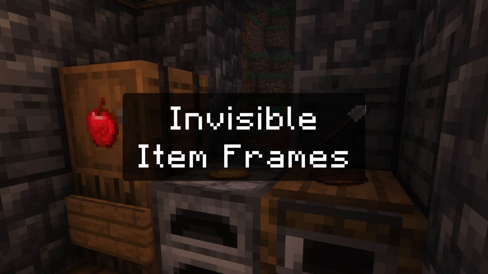
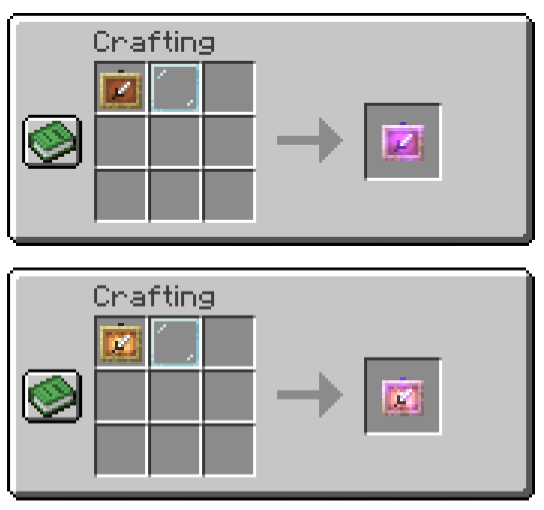

# Transparent Item Frames

Adds craftable invisible item frames to minecraft

Invisible Item frames will stay visible until you put a item inside, so you don't lose them

## Crafting Recipe
Add a glass pane to a Item Frame or a Glow Item Frame to convert it to an invisible one

> In Minecraft the output will be a "Knowledge Book", but it will be converted to the correct item upon you clicking on it

